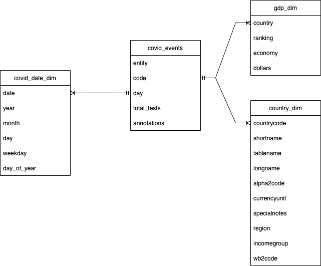

# Covid data analysis

## Overview
This generates covid test results in the contries in Asia in top 100 GDP

## Project description
This projects creates a data pipeline with data files from various resources to enable to generate reports about covid status based on various condition (GDP, region, time line .. ) which can answer for the questions like below:
- what is the total test results of the countries in asia in top 100 GDP in 2020 on Satureday and Sunday?
query:
```
select ce.code, sum(ce.total_tests) as total_tests  From covid_events as ce
left join covid_date_dim as cdd on ce.day = cdd.date
left join gdp_dim as gd on ce.code = gd.country
left join country_dim as cd on ce.code = cd.countrycode
where gd.ranking < 100
and cdd.year = 2020
and cdd.weekday in (5, 6)
and cd.region like '%Asia%'
group by ce.code
order by total_tests DESC
```

## Datasets
### Input
#### covid test result
`data/full-list-total-tests-for-covid-19-origin.csv`
#### country
`data/CountryOrigin.csv`
#### gdp
`data/GDP.csv`
### Schema design
Star schema:


## Components
### S3 (data lake)
S3 stores file data file with unlimited scalability and durability
### Redshift (data warehose)
Redshift is a good columnar OLAP data which guarantees high throughput on reading and writing huge data

## Structure
- run.ipynb
-- run script
- data
-- data directory
- sql_queries.py
-- queries
- create_tables.py
-- script to create tables in redshift
- load_data.py
-- script to ingest data to the tables in redshift
- app.cfg
-- config file

## Run
run run.ipynb

## Scenarios
### The data was increased by 100x.
- S3: No issue since provides unlimited scalability 
- Redshift: enable autho scaling capability
- Process: implement parallel processesing
### The pipelines would be run on a daily basis by 7 am every day.
- Monitor results and send result emails to operator
### The database needed to be accessed by 100+ people.
- Use cache to improve read performance

